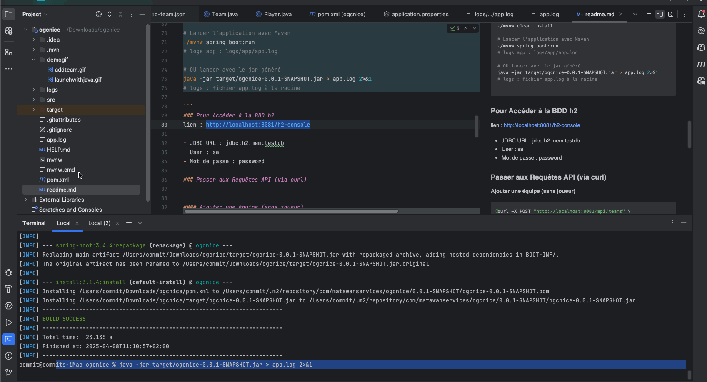
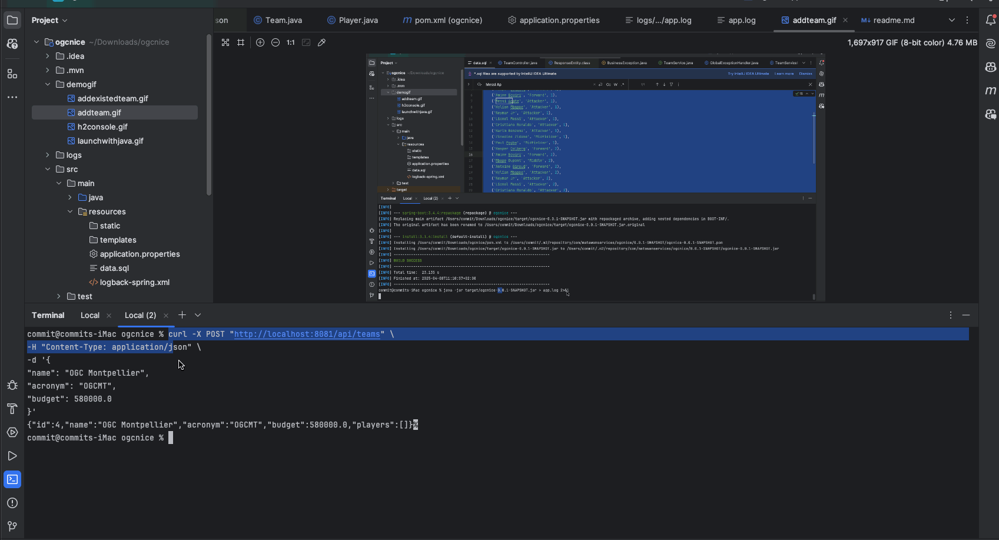
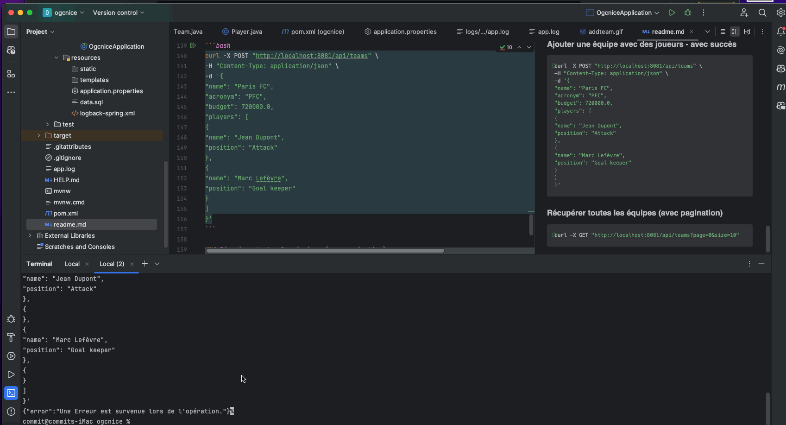
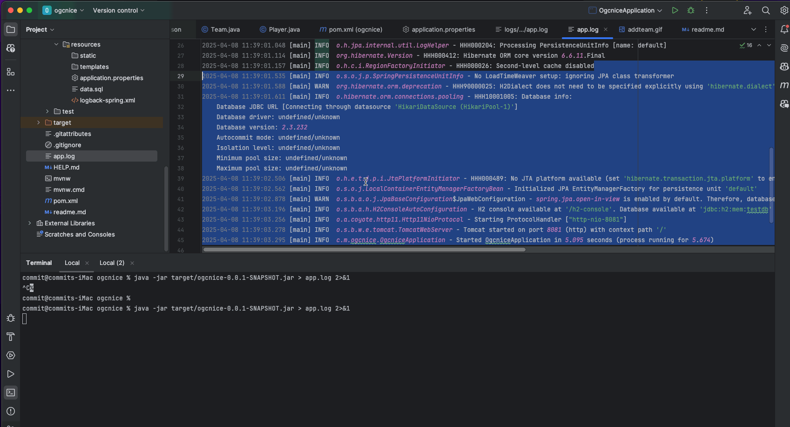
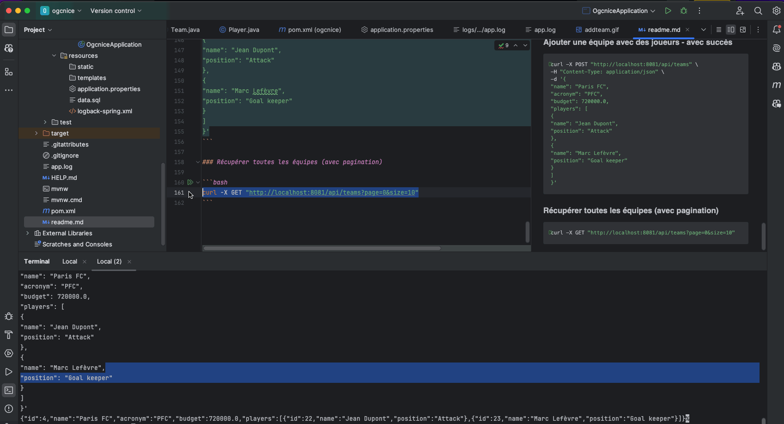

# ⚽ OGC Nice API

Une API REST pour gérer l’équipe de football de Nice en Ligue 1 : création d’équipes, ajout de joueurs, gestion de budget.

---

##  Architecture

Ce projet adopte une **architecture en couches (MVC)**, avec une séparation claire des responsabilités :

- `controllers` : gèrent les requêtes HTTP (REST)
- `services` : logique métier
- `repositories` : accès aux données (Spring Data JPA)
- `models` : entités JPA
- `dtos` : Data Transfer Objects (DTO)
- `exceptions` : gestion centralisée des erreurs

---

## ✅ Bonnes pratiques

- **DTOs** pour éviter d’exposer directement les entités
- **Validation** via `@Valid`
- **Gestion des erreurs** via `@ControllerAdvice`
- **Logging** avec SLF4J / Logback
- **Tests unitaires** avec JUnit / Mockito
- **Tests d’intégration** avec `@SpringBootTest`
- **Pagination & tri**

---

##  Stack technique

- Java 17
- Spring Boot 3.4.4
- Spring Data JPA
- H2 Database (in-memory)
- Maven
- Lombok

---

##  Prérequis

| Outil  | Version recommandée |
|--------|---------------------|
| Java   | 17+                 |
| Maven  | 3.8+                |
| Git    | Dernière version    |

---

##  Lancer le projet

### 🛠 Depuis un terminal

```bash
# Cloner le projet
git clone https://github.com/kAgotsi/ogcnice.git
cd ogcnice

# Lancer les tests
./mvnw test
# logs test : logs/test/test.log

# Compiler et construire le projet
./mvnw clean install

# Lancer l'application avec Maven
./mvnw spring-boot:run
# logs app : logs/app/app.log

# OU lancer avec le jar généré
java -jar target/ogcnice-0.0.1-SNAPSHOT.jar > app.log 2>&1
# logs : fichier app.log à la racine
```
Résultat pour java -jar target/ogcnice-0.0.1-SNAPSHOT.jar > app.log 2>&1


### Pour Accéder à la BDD h2
lien : http://localhost:8081/h2-console

- JDBC URL : jdbc:h2:mem:testdb
- User : sa
- Mot de passe : password

Demo



### Passer aux Requêtes API (via curl)


#### Ajouter une équipe (sans joueur)
```bash
curl -X POST "http://localhost:8081/api/teams" \
-H "Content-Type: application/json" \
-d '{
"name": "OGC Montpellier",
"acronym": "OGCMT",
"budget": 580000.0
}'
```
Demo


### Ajouter une équipe existante (renvoie une erreur)
```bash
curl -X POST "http://localhost:8081/api/teams" \
-H "Content-Type: application/json" \
-d '{
"name": "OGC Montpellier",
"acronym": "OGCMT",
"budget": 580000.0
}'
```
Demo



###  Ajouter une équipe avec des joueurs - ça va générer une erreur de validation puisqu'il y a des joueurs sans données
```bash
curl -X POST "http://localhost:8081/api/teams" \
-H "Content-Type: application/json" \
-d '{
"name": "Paris FC",
"acronym": "PFC",
"budget": 720000.0,
"players": [
{
"name": "Jean Dupont",
"position": "Attack"
},
{
"name": "Marc Lefèvre",
"position": "Goal keeper"
},
{
}
]
}'
```
Demo



###  Ajouter une équipe avec des joueurs - avec succès
```bash
curl -X POST "http://localhost:8081/api/teams" \
-H "Content-Type: application/json" \
-d '{
"name": "Paris FC",
"acronym": "PFC",
"budget": 720000.0,
"players": [
{
"name": "Jean Dupont",
"position": "Attack"
},
{
"name": "Marc Lefèvre",
"position": "Goal keeper"
}
]
}'
```
Demo




### Récupérer toutes les équipes (avec pagination)

```bash
curl -X GET "http://localhost:8081/api/teams?page=0&size=10"
```

Demo




### Amelioration
Je peux rajouter un swagger pour la documentation de l'API 